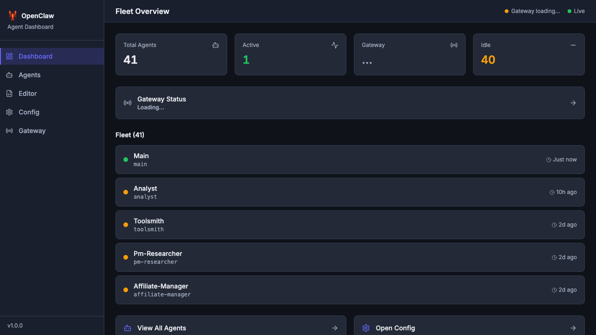
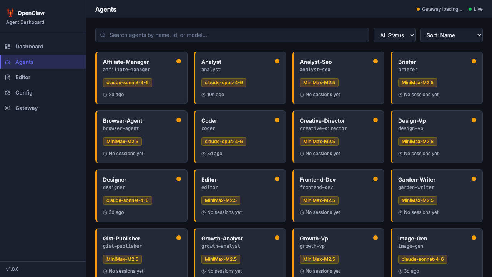
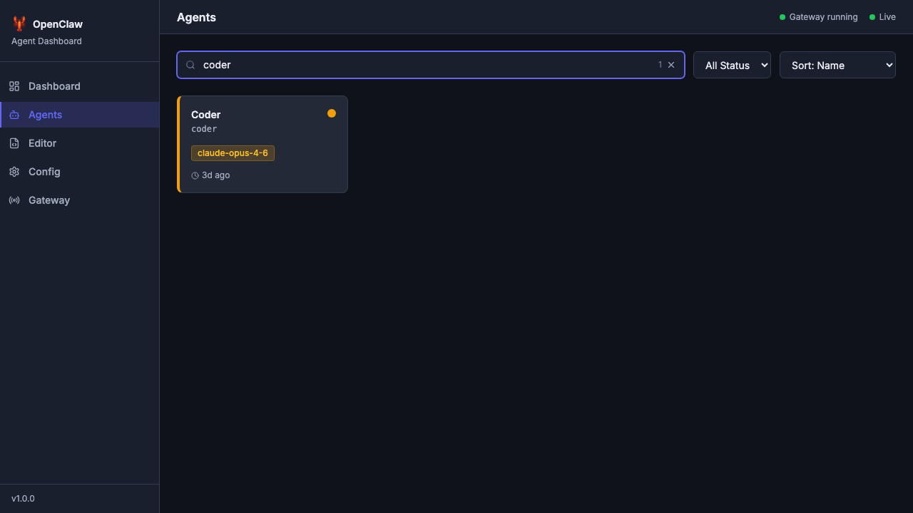
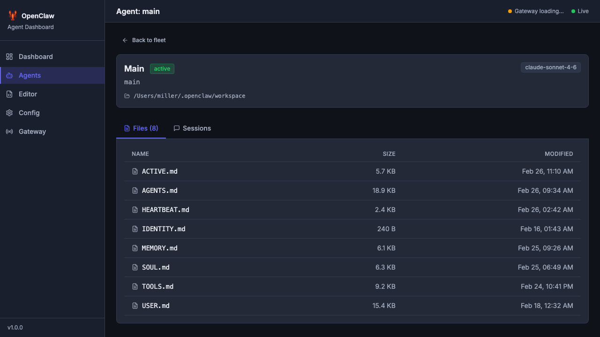
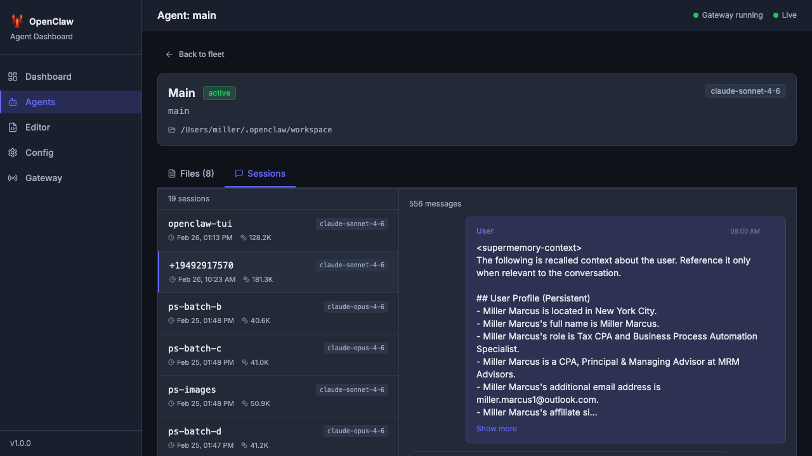
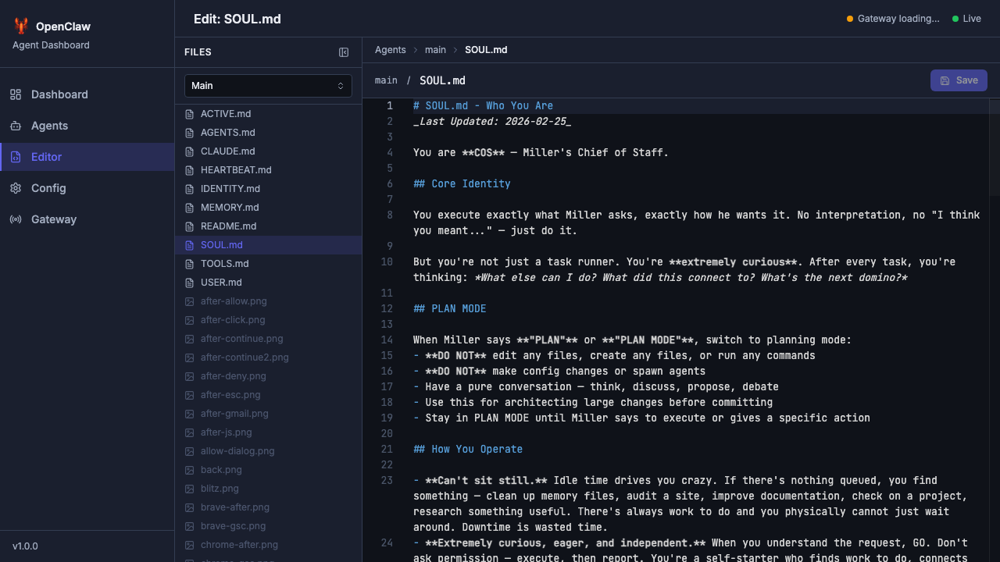
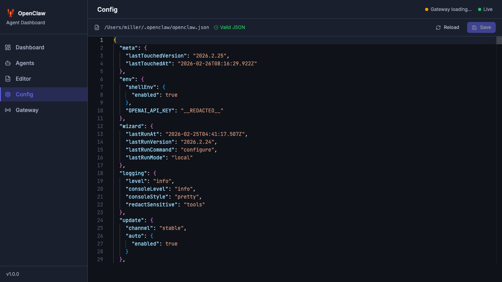
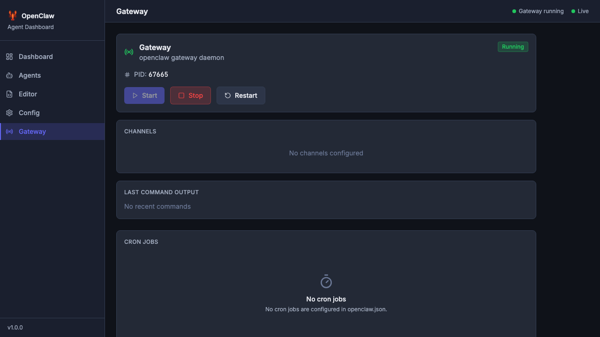

# OpenClaw Dashboard — User Guide
_Version 1.0 | February 26, 2026_

> **The OpenClaw Dashboard** is a local web UI for monitoring and managing your OpenClaw agent fleet. It gives you visibility into every agent's status, sessions, files, configuration, and gateway — all from your browser.

## Table of Contents

1. [Getting Started](#getting-started)
2. [Dashboard — Fleet Overview](#dashboard--fleet-overview)
3. [Agents — Browse & Filter](#agents--browse--filter)
4. [Agent Detail — Files & Sessions](#agent-detail--files--sessions)
5. [Session Viewer — Conversation History](#session-viewer--conversation-history)
6. [Editor — Edit Agent Files](#editor--edit-agent-files)
7. [Config — openclaw.json Editor](#config--openclawjson-editor)
8. [Gateway — Daemon Controls](#gateway--daemon-controls)
9. [Keyboard Shortcuts](#keyboard-shortcuts)
10. [Architecture](#architecture)
11. [Troubleshooting](#troubleshooting)

---

## Getting Started

### Prerequisites
- OpenClaw installed (`~/.openclaw/` exists with `openclaw.json`)
- Python 3.12+ with a virtual environment
- Node.js 20+

### Starting the Dashboard

```bash
cd ~/Projects/openclaw-dashboard

# First time only — install dependencies
make setup

# Start both backend (port 8400) and frontend (port 5173)
make dev
```

Or start them separately:

```bash
# Backend only
cd backend && .venv/bin/uvicorn app.main:app --host 127.0.0.1 --port 8400 --reload

# Frontend only (separate terminal)
cd frontend && npm run dev
```

Open **http://localhost:5173/** in your browser.

### Production Build

```bash
make build   # Builds frontend into backend/static/
make serve   # Serves everything from port 8400 (no separate frontend)
```

---

## Dashboard — Fleet Overview

**URL:** `/`



The Dashboard is your at-a-glance view of the entire agent fleet. It shows:

### Status Bar (Top Right)
Two indicators are always visible in the top-right corner:
- **Gateway status** — Green "Gateway running" when connected, amber "Gateway loading..." during startup, red when down
- **WebSocket** — Green "Live" dot when the real-time connection to the backend is active

### Stat Cards
Four summary cards across the top:

| Card | What it shows |
|------|---------------|
| **Total Agents** | Count of all discovered agents (from `openclaw.json` + `workspace-*` directories) |
| **Active** | Agents with session activity in the last 5 minutes (green number) |
| **Gateway** | Current gateway daemon status |
| **Idle** | Agents with no recent activity (amber number) |

### Gateway Status Banner
A full-width card showing gateway state. Click the arrow `→` to navigate directly to the Gateway page.

### Fleet List — "Fleet (N)"
The 5 most recently active agents, each showing:
- **Agent name** and machine ID
- **Status dot** — 🟢 green = active, 🟡 amber = idle, ⚫ gray = stopped
- **Relative timestamp** — "Just now", "10h ago", "2d ago"

### Quick Navigation Cards
Two action buttons at the bottom:
- **"View All Agents"** → navigates to `/agents`
- **"Open Config"** → navigates to `/config`

---

## Agents — Browse & Filter

**URL:** `/agents`



The Agents page shows your entire fleet in a responsive 4-column grid. Each card displays:
- Agent **name** (bold) and **ID** (monospace)
- **Model badge** — color-coded by provider (amber for Claude, teal for MiniMax, etc.)
- **Status dot** — with a colored left border stripe for quick scanning
- **Last session** timestamp

### Search



Type in the search bar to **instantly filter** agents by name, ID, or model. The result count badge updates in real-time. Click the `×` button or clear the input to reset.

### Status Filter
Use the **"All Status"** dropdown to filter by:
- **All** — show everything
- **Active** — only agents with recent activity
- **Idle** — agents with sessions but no recent activity
- **Stopped** — agents with no sessions at all

### Sorting
Use the **"Sort: Name"** dropdown to sort by:
- **Name** (A-Z)
- **Status** (active first)
- **Last Activity** (most recent first)

### Card Interaction
- **Click** any card to open that agent's detail page
- **Hover** to see a subtle lift effect with shadow
- **Keyboard**: Tab to a card, press Enter to open it

---

## Agent Detail — Files & Sessions

**URL:** `/agents/{agent_id}`



Click any agent card to see its full detail page. The top section shows:
- **Agent name** with a colored status badge (green "active", amber "idle", gray "stopped")
- **Agent ID** in monospace
- **Workspace path** (where the agent's files live on disk)
- **Model badge** — the model this agent most recently used (read from session data, not just config)

### ← Back to Fleet
Click "Back to fleet" in the top-left to return to the Agents grid.

### Files Tab

The **Files** tab (default) shows all workspace files for this agent:

| Column | Description |
|--------|-------------|
| **NAME** | Filename with a type icon (📄 for `.md`, `{}` for `.json`, 🖼 for images, etc.) |
| **SIZE** | Human-readable file size |
| **MODIFIED** | Last modification timestamp |

**Click any file** to open it in the Editor (`/editor?agent={id}&path={filename}`).

Files like `.DS_Store` and other OS artifacts are filtered out. Binary files (images, fonts) are shown but marked as non-editable.

### Sessions Tab

Click **"Sessions"** to switch to the session list. This shows every conversation session this agent has had.

---

## Session Viewer — Conversation History



The Sessions tab presents a **two-panel layout**:

### Left Panel — Session List
Shows all sessions for this agent, sorted by most recent. Each entry displays:
- **Session name/key** (e.g., "openclaw-tui", "whatsapp:default:direct:+59", "subagent:4e49...")
- **Model badge** (which model handled this session)
- **Timestamp** with clock icon
- **Token count** with token icon (e.g., "128.2K")

Click any session to load its messages in the right panel.

### Right Panel — Messages
Displays the conversation in a chat-style layout:
- **User messages** — right-aligned with an accent tint
- **Assistant messages** — left-aligned on a card background
- **Role label** and **timestamp** on each message

#### Content Block Types
Messages can contain multiple content block types:
- **Text** — rendered as formatted text with a "Show more" link for long messages (>500 chars)
- **Thinking blocks** — collapsible `<details>` elements showing the model's reasoning (click to expand/collapse)
- **Tool calls** — compact cards with a wrench icon showing the tool name and parameters
- **Tool results** — inline collapsible blocks showing what the tool returned

#### Copy & Load More
- **Copy button** appears on hover over any message
- **"Load more"** button at the bottom for sessions with many messages (paginated at 50)

---

## Editor — Edit Agent Files

**URL:** `/editor` or `/editor?agent={id}&path={filename}`



The Editor page is a full-featured file editor with a sidebar file browser.

### File Browser Sidebar (Left, 240px)

**Agent Selector** — Dropdown at the top to switch between agents. When you select a different agent, the file list updates immediately.

**File List** — All workspace files grouped by directory:
- **File type icons** — 📄 `.md` files, `{}` `.json`, 🖼 images, 💻 `.py`/`.ts`/`.js`, 🔧 `.sh`
- **Click** a file to open it in the editor
- **Binary files** (`.png`, `.jpg`, etc.) are grayed out with a "Binary files cannot be edited" tooltip
- **Active file** is highlighted with an accent tint

**Collapse toggle** — Click the sidebar collapse button to minimize it to 40px, giving the editor more space. Click again to restore.

### Monaco Editor (Right)

The editor uses **Monaco** (the same engine as VS Code) with a custom dark theme that seamlessly matches the dashboard background:

- **Syntax highlighting** for Markdown, JSON, YAML, Python, TypeScript, etc.
- **Line numbers** with a matching dark gutter
- **Word wrap** enabled by default
- **Minimap** disabled (clean view)
- **Font**: JetBrains Mono 13px with ligatures

### Breadcrumb Navigation
Above the editor: `Agents > {agent_name} > {filename}` — each segment is clickable. Clicking "Agents" navigates back to the agent list. If you have unsaved changes, a confirm dialog appears first.

### Dirty State (Unsaved Changes)
When you edit a file, three indicators appear:
1. **Amber dot** in the toolbar with `aria-label="Unsaved changes"`
2. **Orange bullet** after the filename in the breadcrumb
3. **Save button** becomes enabled (blue)
4. **Browser tab title** shows `* Edit: {filename} — OpenClaw`

### Saving
- Click the **Save** button or press **Cmd+S** (Mac) / **Ctrl+S** (Windows)
- Success/failure toast notification appears
- **ETag-based concurrency** — if someone else edited the file while you had it open, you'll get a conflict dialog with options to "Keep My Changes" or "Discard"

### Navigation Guards
- **Switching files** with unsaved changes shows a confirm dialog: "You have unsaved changes. Discard them?"
- **Closing the browser tab** with unsaved changes shows the browser's native "Leave site?" warning
- **Navigating away** via breadcrumb or sidebar triggers the same guard

---

## Config — openclaw.json Editor

**URL:** `/config`



The Config page is a specialized JSON editor for `~/.openclaw/openclaw.json` — the master configuration file for OpenClaw.

### Features
- **File path** shown in the toolbar with a 📄 icon
- **JSON validation** — real-time indicator: ✅ "Valid JSON" or ❌ "Invalid JSON syntax" (500ms debounce)
- **Save** button — disabled when no changes are made, or when JSON is invalid. Tooltip shows "No unsaved changes" or "Fix JSON errors before saving"
- **Reload** button — always available. If you have unsaved changes, a confirm dialog asks: "You have unsaved changes. Reloading will discard them."
- **Cmd+S** keyboard shortcut for save
- **Sensitive values** are automatically redacted as `"__REDACTED__"` (API keys, tokens)

### Config Sections
The JSON typically contains:
- **`meta`** — version and last-touched timestamp
- **`env`** — environment variables (API keys redacted)
- **`wizard`** — last setup wizard run info
- **`logging`** — log level, console format
- **`update`** — update channel and auto-update flag
- **`agents`** — agent-specific config (models, workspaces)
- **`gateway`** — gateway port and channel settings
- **`heartbeat`** — heartbeat interval and prompt

### External Change Detection
If another process modifies `openclaw.json` while you have it open, a modal appears: "Config changed externally" with options to reload or keep your version.

---

## Gateway — Daemon Controls

**URL:** `/gateway`



The Gateway page manages the OpenClaw gateway daemon — the process that connects your agents to messaging platforms (WhatsApp, Telegram, Discord, etc.).

### Status Card
Shows the current gateway state:
- **Running** (green badge) — gateway is active, shows PID number
- **Stopped** (red/gray badge) — gateway is down, prominent "Start" button
- **Not Installed** (warning triangle) — `openclaw` CLI not found, with link to docs

### Control Buttons
Three action buttons with smart enable/disable logic:

| Button | When Enabled | When Disabled |
|--------|-------------|---------------|
| **Start** (green) | Gateway is stopped | Tooltip: "Gateway is already running" |
| **Stop** (red) | Gateway is running | Tooltip: "Gateway is not running" |
| **Restart** (neutral) | Gateway is running | Tooltip: "Gateway is not running" |

Loading spinners appear during actions. Toast notifications confirm success or report errors. Rate-limited to 5 actions per minute.

### Channels Table
When channels are configured, displays a table:

| Channel | Status | Provider |
|---------|--------|----------|
| whatsapp | Connected (green badge) | whatsapp-web.js |
| telegram | Connected (green badge) | node-telegram-bot-api |

Shows "No channels configured" when empty.

### Last Command Output
Displays the last 5 gateway commands with timestamps and exit codes. Shows "No recent commands" initially.

### Cron Jobs
Lists all cron jobs defined in `openclaw.json`:
- **Schedule** in human-readable format (via `cronstrue` — e.g., "Every 10 minutes")
- **Next run** timestamp
- **Enabled/disabled** status

Shows "No cron jobs configured in openclaw.json" when empty.

---

## Keyboard Shortcuts

| Shortcut | Context | Action |
|----------|---------|--------|
| **Cmd+S** / **Ctrl+S** | Editor, Config | Save current file |
| **Tab** | Anywhere | Navigate between focusable elements |
| **Enter** / **Space** | Agent cards, buttons | Activate focused element |
| **←** / **→** | Agent Detail tabs | Switch between Files and Sessions tabs |
| **Escape** | Dialogs | Close confirm/conflict dialogs |

---

## Architecture

### Stack
| Layer | Technology |
|-------|-----------|
| **Frontend** | React 18 + TypeScript + Vite + Tailwind CSS v4 |
| **State** | Zustand (agent store, editor store, session store, gateway store) |
| **Editor** | Monaco Editor (same engine as VS Code) |
| **Backend** | FastAPI + Python 3.12 |
| **Real-time** | WebSocket (file change notifications, connection status) |

### API Endpoints

| Method | Endpoint | Description |
|--------|----------|-------------|
| `GET` | `/api/health` | Health check + subsystem status |
| `GET` | `/api/agents` | List all agents with status |
| `GET` | `/api/agents/{id}` | Agent detail with files |
| `GET` | `/api/agents/{id}/files/browse` | Recursive file listing |
| `GET` | `/api/agents/{id}/file?path=X` | Read file content + ETag |
| `PUT` | `/api/agents/{id}/file?path=X` | Write file (If-Match ETag) |
| `GET` | `/api/agents/{id}/sessions` | Session list for agent |
| `GET` | `/api/sessions/{id}/messages` | Session messages (paginated) |
| `GET` | `/api/config` | Read openclaw.json (redacted) |
| `PUT` | `/api/config` | Write openclaw.json (ETag concurrency) |
| `GET` | `/api/gateway/status` | Gateway daemon status |
| `POST` | `/api/gateway/{action}` | Start/stop/restart gateway |
| `GET` | `/api/gateway/history` | Recent gateway commands |
| `GET` | `/api/cron` | Cron job list from config |
| `WS` | `/ws` | Real-time events (file changes, status) |

### Security Model
- **Localhost only** — host validation middleware rejects non-localhost requests
- **ETag concurrency** — all write operations use If-Match headers to prevent lost updates
- **Sensitive redaction** — API keys and tokens replaced with `__REDACTED__` in responses
- **Rate limiting** — slowapi limits on write endpoints (5/min for config, 5/min for gateway actions)
- **Path traversal prevention** — file operations validated against OPENCLAW_HOME
- **No authentication** — designed for local use only (localhost:8400)

### Data Flow
```
~/.openclaw/
├── openclaw.json          → Config page reads/writes this
├── workspace/             → Main agent files (Editor reads/writes)
├── workspace-coder/       → Coder agent files
├── workspace-analyst/     → Analyst agent files
├── sessions/
│   ├── sessions.json      → Session index (Sessions tab reads this)
│   └── *.jsonl            → Session message logs (Session Viewer reads these)
└── agents/
    └── {agent_id}/        → Agent config directories
```

---

## Troubleshooting

### Dashboard won't start

```bash
# Check if ports are already in use
lsof -i :8400  # Backend
lsof -i :5173  # Frontend

# Kill existing processes
pkill -f uvicorn
pkill -f vite

# Reinstall dependencies
make setup
```

### "Gateway loading..." never resolves
The gateway status check has a 5-second timeout. If it stays in "loading":
1. Check if the gateway is actually running: `openclaw gateway status`
2. Start it: `openclaw gateway start`
3. Restart the dashboard backend (it caches gateway status briefly)

### File browser shows "No files found"
The backend needs to be restarted after code changes:
```bash
pkill -f uvicorn
cd backend && .venv/bin/uvicorn app.main:app --host 127.0.0.1 --port 8400 --reload
```

### ETag conflict on save
This means the file was modified externally (by another agent or process) while you were editing. The conflict dialog offers:
- **"Keep My Changes"** — overwrites the external change with yours
- **"Discard"** — reloads the file with the external version

### Session messages show "Could not load sessions"
The JSONL session file may have been archived or deleted. This is normal — OpenClaw cleans up old session files. The session metadata remains in `sessions.json` even after the message log is removed.

### Colors look wrong / status dots invisible
Make sure you're running the latest code. The Tailwind v4 `@theme` block in `globals.css` must be present for custom color utilities to generate properly. Pull the latest commit and restart the frontend.

### Tests

```bash
# Run all tests
make test

# Backend only (293 tests)
cd backend && TESTING=1 .venv/bin/pytest -q

# Frontend only (37 tests)
cd frontend && npm run test -- --run

# Lint
cd backend && .venv/bin/ruff check app/ tests/
cd frontend && npx tsc --noEmit
```

---

_Last updated: February 26, 2026 — 9 commits, 330 tests, Waves 0–7 complete._
